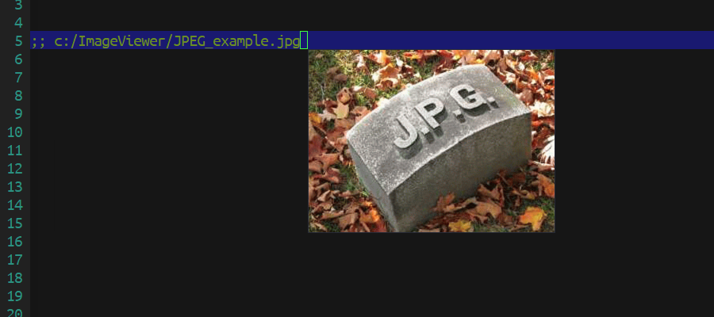

[](https://www.gnu.org/licenses/gpl-3.0)
[](https://jcs-emacs.github.io/jcs-elpa/#/preview-it)

# preview-it
> Preview anything at point.

[](https://github.com/jcs-elpa/preview-it/actions/workflows/test.yml)

Preview `file`, `image`, and `website` by moving cursor on top of target.

## 🏆 Features

This package current supports viewing these items.

* File (absolute/relative)
* Image
* Url/Link

| Preview File       | Preview Image        |
|:-------------------|:---------------------|
|  |  |

| Preview Url        | Color                |
|:-------------------|:---------------------|
|  |  |

## 🔨 Usage

You can enable this feature by the following command. So it will work every time
your cursor is hovering anything that can be preview.

```
M-x preview-it-mode
```

To enabled it globally, use the following command instead.

```
M-x global-preview-it-mode
```

You can also called `preview-it` function directly to preview thing at the current
cursor's position.

## 🔧 Customization

#### 🧪 Variables

* `preview-it-delay` - Seconds delay to show preview.
* `preview-it-render-md` - Set to non-nil, render markdown file.
* `preview-it-color-text` - String to display color.

#### 🧪 Face

* `preview-it-background` - Background color of the preview buffer.

## Contribute

[](http://makeapullrequest.com)
[](https://github.com/bbatsov/emacs-lisp-style-guide)
[](https://www.paypal.me/jcs090218)
[](https://www.patreon.com/jcs090218)

If you would like to contribute to this project, you may either
clone and make pull requests to this repository. Or you can
clone the project and establish your own branch of this tool.
Any methods are welcome!
